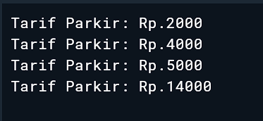

# Latihan 2 — Tarif Parkir

Program ini merupakan latihan Dart untuk menghitung tarif parkir berdasarkan **jenis kendaraan** dan **durasi parkir**.

Pada latihan ini digunakan konsep dasar Dart berupa:

* `enum`
* Function
* Operator `~/`
* Operator `%`
* `if`
* `switch`
* String interpolation

## Business Rule

| Kode  | Business Rule                                                                       |
| ----- | ----------------------------------------------------------------------------------- |
| BR-01 | Durasi parkir dihitung per jam, sisa menit dibulatkan ke atas dengan minimal 1 jam. |
| BR-02 | Motor: Rp2.000 untuk jam pertama dan Rp1.000 untuk setiap jam berikutnya.           |
| BR-03 | Mobil: Rp5.000 untuk jam pertama dan Rp3.000 untuk setiap jam berikutnya.           |

## Petunjuk

Program menggunakan:

```dart
enum JenisKendaraan { motor, mobil }
```

Selain itu digunakan operator `~/` dan `%` untuk menghitung durasi parkir serta `switch` untuk menentukan tarif berdasarkan jenis kendaraan.

## Source Code

```dart
enum JenisKendaraan { motor, mobil }

int hitungTarif(JenisKendaraan jenis, int menit) {
  int jam = menit ~/ 60;
  int sisaMenit = menit % 60;

  if (sisaMenit > 0) {
    jam++;
  }

  switch (jenis) {
    case JenisKendaraan.motor:
      if (jam <= 1) {
        return 2000;
      }
      return 2000 + (jam - 1) * 1000;

    case JenisKendaraan.mobil:
      if (jam <= 1) {
        return 5000;
      }
      return 5000 + (jam - 1) * 3000;
  }
}

void main() {
  print('Tarif Parkir: Rp.${hitungTarif(JenisKendaraan.motor, 30)}');
  print('Tarif Parkir: Rp.${hitungTarif(JenisKendaraan.motor, 150)}');
  print('Tarif Parkir: Rp.${hitungTarif(JenisKendaraan.mobil, 60)}');
  print('Tarif Parkir: Rp.${hitungTarif(JenisKendaraan.mobil, 181)}');
}
```

## Penjelasan Program

### 1. Enum `JenisKendaraan`

```dart
enum JenisKendaraan { motor, mobil }
```

Enum digunakan untuk menentukan jenis kendaraan yang diperbolehkan dalam program, yaitu `motor` dan `mobil`.

### 2. Function `hitungTarif`

```dart
int hitungTarif(JenisKendaraan jenis, int menit)
```

Function menerima dua parameter:

* `jenis` → menentukan jenis kendaraan.
* `menit` → menentukan durasi parkir dalam menit.

Function mengembalikan nilai `int` berupa tarif parkir.

### 3. Menghitung Durasi

Operator `~/` digunakan untuk mendapatkan jumlah jam penuh:

```dart
int jam = menit ~/ 60;
```

Sedangkan operator `%` digunakan untuk mendapatkan sisa menit:

```dart
int sisaMenit = menit % 60;
```

Jika masih terdapat sisa menit, maka durasi dibulatkan ke atas:

```dart
if (sisaMenit > 0) {
  jam++;
}
```

Contohnya, jika kendaraan parkir selama 150 menit:

```text
150 ~/ 60 = 2 jam
150 % 60 = 30 menit
```

Karena masih terdapat sisa 30 menit, maka durasi menjadi **3 jam**.

### 4. Menentukan Tarif dengan `switch`

`switch` digunakan untuk membedakan tarif berdasarkan jenis kendaraan.

Untuk motor:

```dart
return 2000 + (jam - 1) * 1000;
```

Sedangkan untuk mobil:

```dart
return 5000 + (jam - 1) * 3000;
```

Dengan demikian, jam pertama memiliki tarif berbeda dengan jam berikutnya sesuai dengan business rule yang diberikan.

## Skenario Pengujian

| Skenario | Kendaraan |    Durasi | Expected Tarif |    Hasil |
| -------- | --------- | --------: | -------------: | -------: |
| 1        | Motor     |  30 menit |        Rp2.000 |  Rp2.000 |
| 2        | Motor     | 150 menit |        Rp4.000 |  Rp4.000 |
| 3        | Mobil     |  60 menit |        Rp5.000 |  Rp5.000 |
| 4        | Mobil     | 181 menit |       Rp14.000 | Rp14.000 |

## Output Program




